# Konfigurasi Firewall Rules

## Konfigurasi Firewall *Allow HTTP*
1. Dari navigasi menu, pilih VPC Network > Firewall


2. Pada halaman Firewall, klik tombol **CREATE FIREWALL RULE**
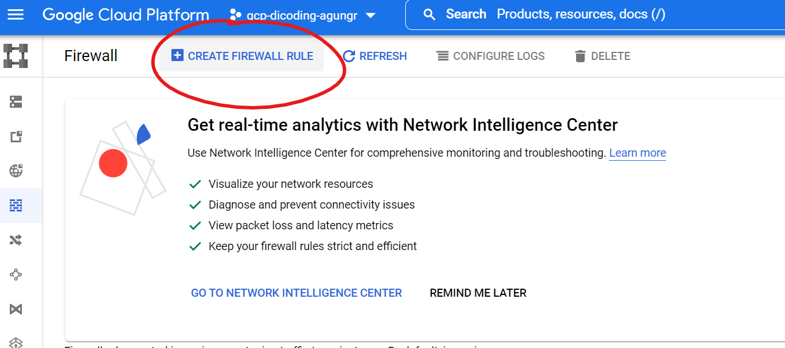

3. Isi form sesuai dengan requirement:
    >**Name**: dicoding-allow-http\
    >**Targets**: Specified target tags\
    >**Target tags**: dicoding-http-server\
    >**Source filter**: IPv4 ranges\
    >**Source IPv4 ranges**: 0.0.0.0/0\
    >**Protocols and ports**: 
    >- Specified protocols and ports 
    >    -  TCP : 80
    >
    >**lainnya**: default

    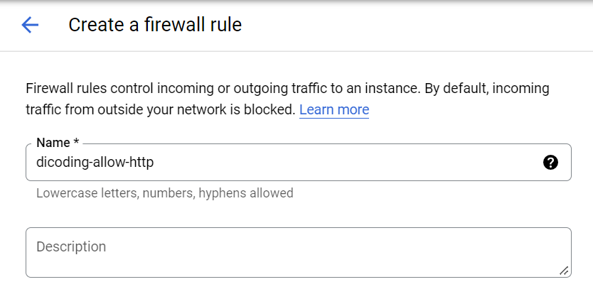
    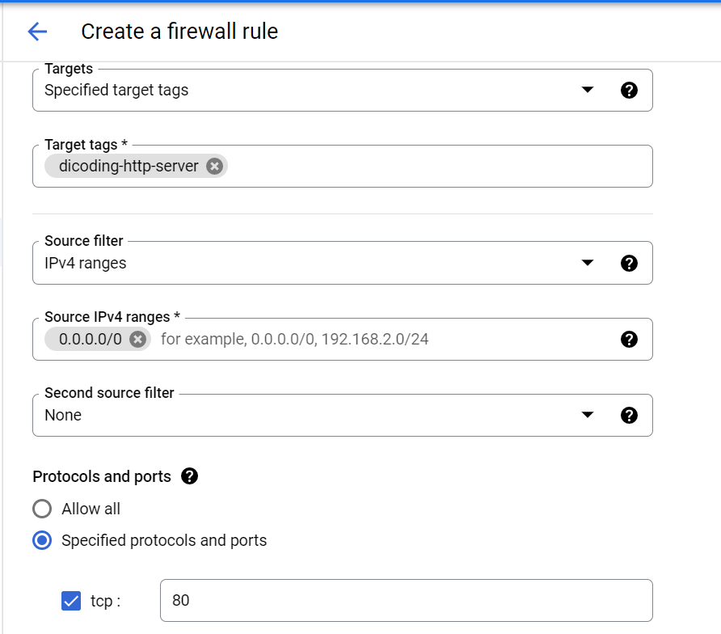

4. Jika sudah selesai, tekan tombol **CREATE**
    #### Proses diatas, juga dapat dilakukan via console, dengan script dibawah
    ```c
    gcloud compute --project=gcp-dicoding-agungr firewall-rules create dicoding-allow-http --direction=INGRESS --priority=1000 --network=default --action=ALLOW --rules=tcp:80 --source-ranges=0.0.0.0/0 --target-tags=dicoding-http-server
    ```

## Konfigurasi Firewall *Allow HTTP Check*
1. Pada halaman Firewall, klik tombol **CREATE FIREWALL RULE**


2. Isi form sesuai dengan requirement:
    >**Name**: dicoding-allow-httpcheck\
    >**Targets**: Specified target tags\
    >**Target tags**: dicoding-http-server\
    >**Source filter**: IPv4 ranges\
    >**Source IPv4 ranges**: 130.211.0.0/22, 35.191.0.0/16\
    >**Protocols and ports**: 
    >- Specified protocols and ports, centang **TCP** tanpa mengisi port
    >**lainnya**: default
        
    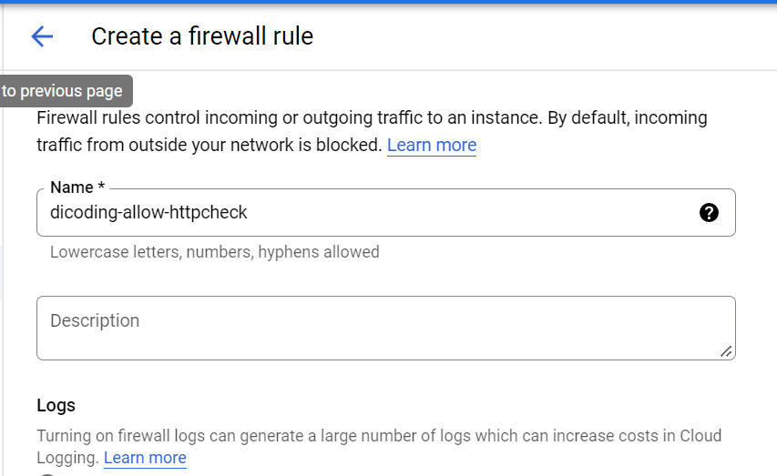
    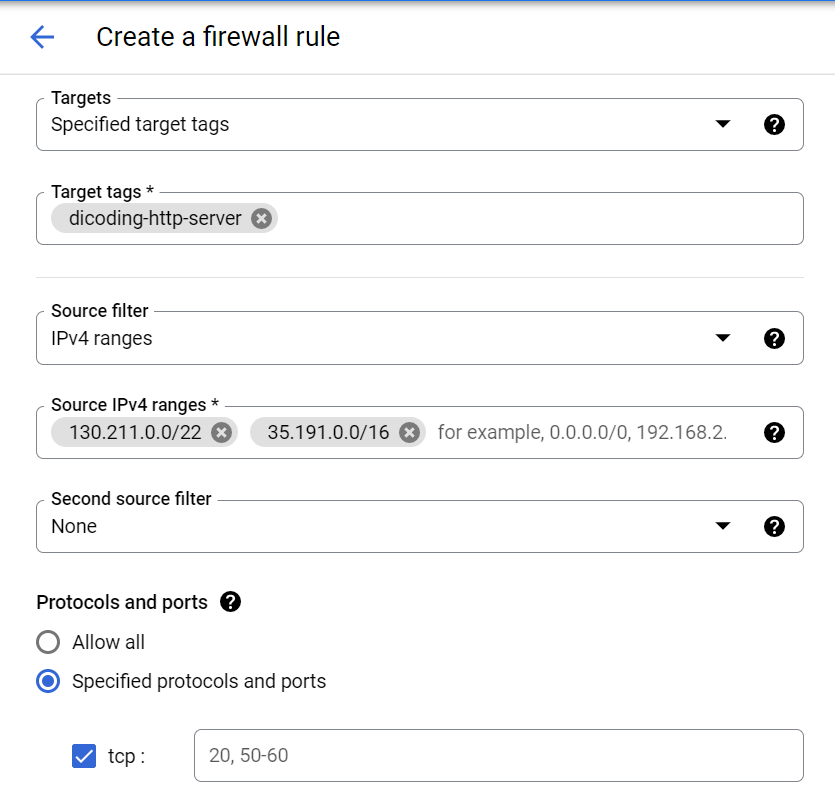

4. Jika sudah selesai, tekan tombol **CREATE**
    #### Proses diatas, juga dapat dilakukan via console, dengan script dibawah
    ```c
    gcloud compute --project=gcp-dicoding-agungr firewall-rules create dicoding-allow-httpcheck --direction=INGRESS --priority=1000 --network=default --action=ALLOW --rules=tcp --source-ranges=130.211.0.0/22,35.191.0.0/16 --target-tags=dicoding-http-server
    ```

## Konfigurasi Instance Templates dan Instance Groups

>Untuk membuat load balancer, kita perlu menggunakan Managed Instance Group. Untuk membuatnya, kita memerlukan Instance Template untuk Autoscaling.

1. Masuk Navigation menu pilih **Compute Engine** > **Instance Template** 
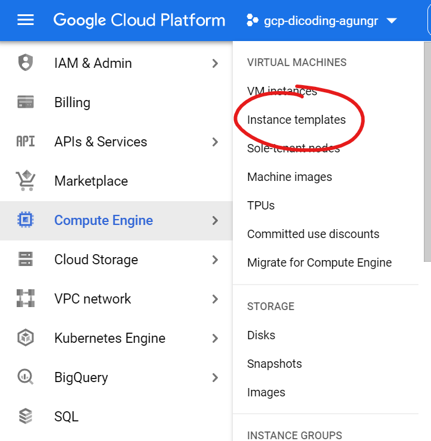

2. Klik **CREATE INSTANCE TEMPLATE**
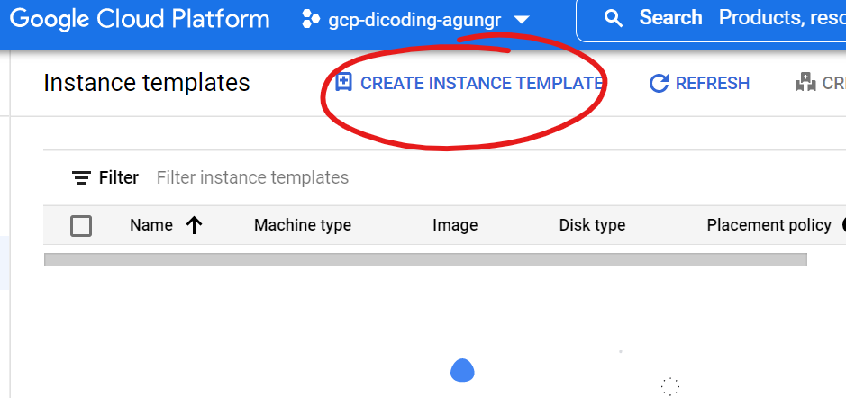

3. Beri nama Instance


4. Karena hanya menampilkan web sederhana, saya sesuaikan **Machine Configuration** dengan spec yang lebih rendah
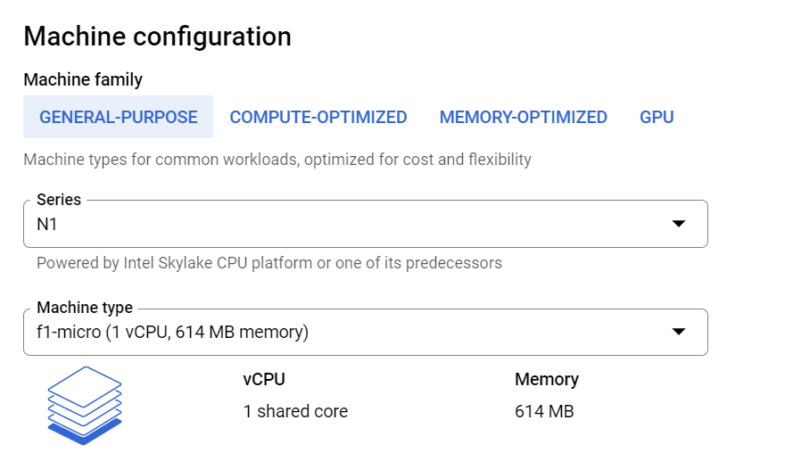

5. Buka panah pada **Networking, Disks, Security, Management, Sole-Tenancy**

6. Pada bagian **Networking**, isi network tags dengan tag yang sudah dibuat sebelumnya
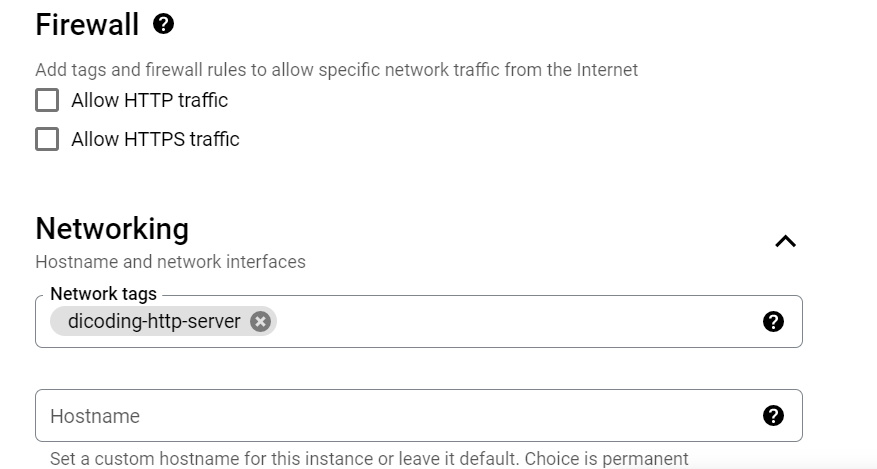

7. Pada bagian **Management** isi startup script dengan script berikut untuk melakukan instalasi web server apache
    ```c
    sudo apt-get update
    sudo apt-get install apache2 -y
    echo '<!doctype html><html><body><h1>Hello from Jakarta!<h1></body></html>' | sudo tee /var/www/html/index.html
    ```
    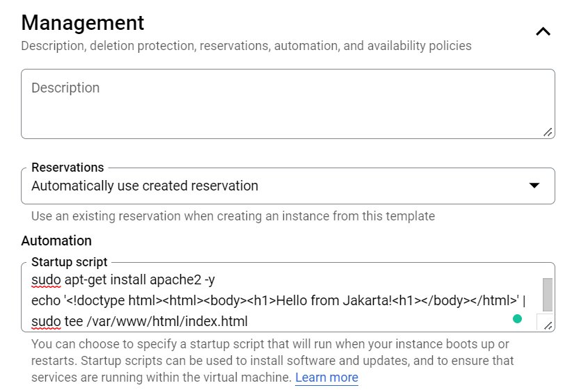

8. Jika sudah, tekan tombol **CREATE**

9. Kemudian buat 1 Instance Template lagi untuk region europe-west1. centang template **asia-southeast2-template**, kemudian tekan **COPY**
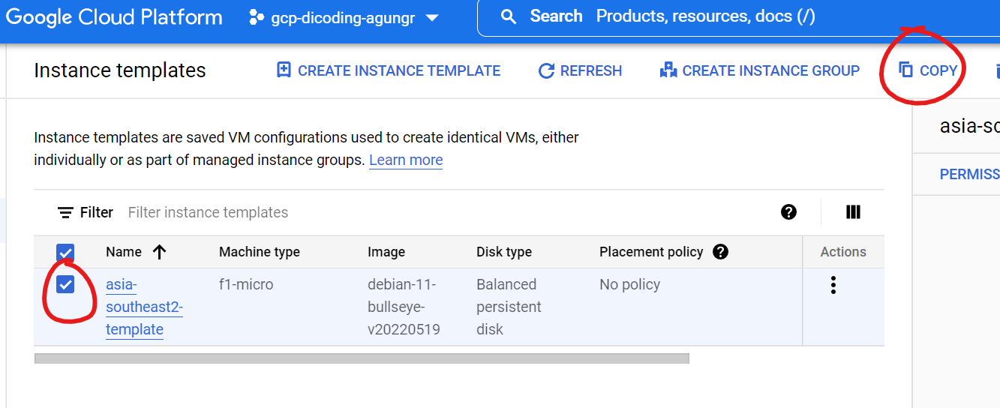

10. Ganti nama template *europe-west1-template*
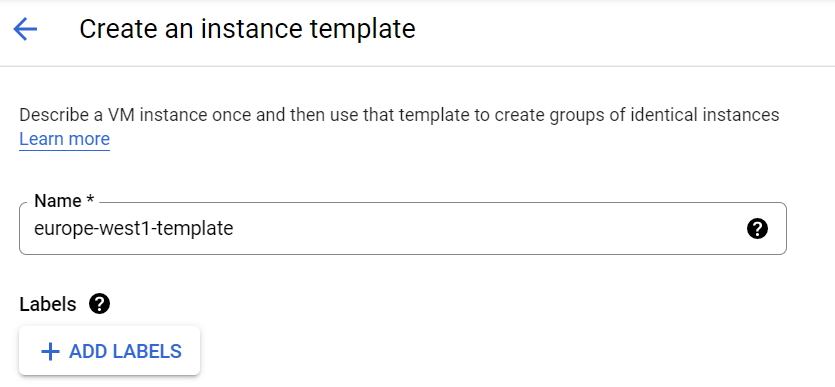

11. Buka panah pada **Networking, Disks, Security, Management, Sole-Tenancy**. Pada bagian **Management** rubah script html
    ```c
    sudo apt-get update
    sudo apt-get install apache2 -y
    echo '<!doctype html><html><body><h1>Hello from Europe!<h1></body></html>' | sudo tee /var/www/html/index.html
    ```
    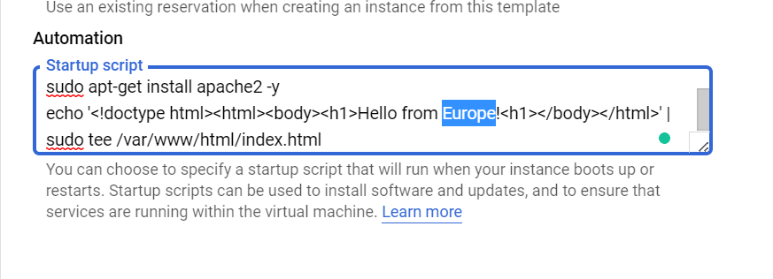

12. Jika sudah tekan **CREATE**

13. Maka saat ini sudah ada 2 template Instance yang sudah dibuat


Selanjutnya kita akan buat instance group yang bersumber dari instance template yang sudah dibuat tadi.

1. Buka halaman **Instance Group**
