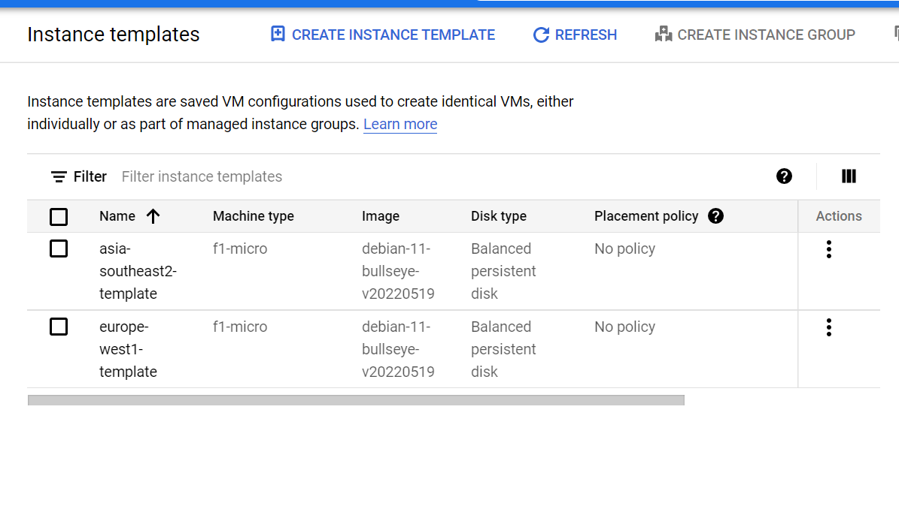

# Konfigurasi Firewall Rules

## Konfigurasi Firewall *Allow HTTP*
1. Dari navigasi menu, pilih VPC Network > Firewall

    
<br/>

2. Pada halaman Firewall, klik tombol **CREATE FIREWALL RULE**

    
<br/>

3. Isi form sesuai dengan requirement:
    >**Name**: dicoding-allow-http\
    >**Targets**: Specified target tags\
    >**Target tags**: dicoding-http-server\
    >**Source filter**: IPv4 ranges\
    >**Source IPv4 ranges**: 0.0.0.0/0\
    >**Protocols and ports**: 
    >- Specified protocols and ports 
    >    -  TCP : 80
    >
    >**lainnya**: default

    
    
<br/>

4. Jika sudah selesai, tekan tombol **CREATE**
    #### Proses diatas, juga dapat dilakukan via console, dengan script dibawah
    ```c
    gcloud compute --project=gcp-dicoding-agungr firewall-rules create dicoding-allow-http --direction=INGRESS --priority=1000 --network=default --action=ALLOW --rules=tcp:80 --source-ranges=0.0.0.0/0 --target-tags=dicoding-http-server
    ```

## Konfigurasi Firewall *Allow HTTP Check*
1. Pada halaman Firewall, klik tombol **CREATE FIREWALL RULE**
    
<br/>

2. Isi form sesuai dengan requirement:
    >**Name**: dicoding-allow-httpcheck\
    >**Targets**: Specified target tags\
    >**Target tags**: dicoding-http-server\
    >**Source filter**: IPv4 ranges\
    >**Source IPv4 ranges**: 130.211.0.0/22, 35.191.0.0/16\
    >**Protocols and ports**: 
    >- Specified protocols and ports, centang **TCP** tanpa mengisi port
    >**lainnya**: default

    
    
<br/>

4. Jika sudah selesai, tekan tombol **CREATE**
    #### Proses diatas, juga dapat dilakukan via console, dengan script dibawah
    ```c
    gcloud compute --project=gcp-dicoding-agungr firewall-rules create dicoding-allow-httpcheck --direction=INGRESS --priority=1000 --network=default --action=ALLOW --rules=tcp --source-ranges=130.211.0.0/22,35.191.0.0/16 --target-tags=dicoding-http-server
    ```

## Konfigurasi Instance Templates dan Instance Groups

>Untuk membuat load balancer, kita perlu menggunakan Managed Instance Group. Untuk membuatnya, kita memerlukan Instance Template untuk Autoscaling.

1. Masuk Navigation menu pilih **Compute Engine** > **Instance Template** \
    
<br/>

2. Klik **CREATE INSTANCE TEMPLATE**
    
<br/>

3. Beri nama Instance
    
<br/>

4. Karena hanya menampilkan web sederhana, saya sesuaikan **Machine Configuration** dengan spec yang lebih rendah
    
<br/>

5. Buka panah pada **Networking, Disks, Security, Management, Sole-Tenancy**

6. Pada bagian **Networking**, isi network tags dengan tag yang sudah dibuat sebelumnya
    
<br/>

7. Pada bagian **Management** isi startup script dengan script berikut untuk melakukan instalasi web server apache
    ```c
    sudo apt-get update
    sudo apt-get install apache2 -y
    echo '<!doctype html><html><body><h1>Hello from Jakarta!<h1></body></html>' | sudo tee /var/www/html/index.html
    ```
    
<br/>

8. Jika sudah, tekan tombol **CREATE**

9. Kemudian buat 1 Instance Template lagi untuk region europe-west1. centang template **asia-southeast2-template**, kemudian tekan **COPY**

    
<br/>

10. Ganti nama template *europe-west1-template*

    
<br/>

11. Buka panah pada **Networking, Disks, Security, Management, Sole-Tenancy**. Pada bagian **Management** rubah script html
    ```c
    sudo apt-get update
    sudo apt-get install apache2 -y
    echo '<!doctype html><html><body><h1>Hello from Europe!<h1></body></html>' | sudo tee /var/www/html/index.html
    ```
    
    
<br/>

12. Jika sudah tekan **CREATE**

13. Maka saat ini sudah ada 2 template Instance yang sudah dibuat

    
<br/>

Selanjutnya kita akan buat instance group yang bersumber dari instance template yang sudah dibuat tadi.

1. Buka halaman **Instance Group**

    
<br/>

2. Tekan tombol **CREATE INSTANCE GROUP**


3. Isi pada form seperti berikut:
    >**Name** : asia-southeast2-group\
    >**instance template** : asia-southeast2-template\
    >**location** : multizone, region: asia-southeast2\
    >**minimum instance** : 1\
    >**maximum instance** : 5\
    >**Metric CPU Utilization** : 80%

    
    
    
<br/>

4. Setelah itu tekan **CREATE**

5. Maka pada halaman instance grup akan terbentuk instance group baru

    
<br/>

6. Masuk ke menu **VM Instance**, maka akan terbentuk instance group baru dengan nama *asia-southeast2-group-xxxx*

    
<br/>

7. Browse External IP VM tersebut untuk memastikan bahwa web server sudah berjalan


8. Jika tampilan seperti ini, maka web server sudah berjalan sesuai template yang sudah dibuat

    
<br/>

9. Selanjutnya, kita akan buat 1 group instance untuk region europe.

    
    
    
<br/>

10. Saat ini sudah ada 2 instance group
    
<br/>

11. Dan kita bisa lakukan pengecekan kembali di menu **VM INSTANCE** untuk memastikan web server pada europe sudah bisa diakses
    
<br/>

Saat ini kita sudah berhasil membuat 2 instance group yang akan kita gunakan sebagai Backend HTTP Load balancer


## Konfigurasi HTTP Load Balancer

1. Buka halaman load balancing melalui **Navigation Menu** -> **Network services** -> **Load balancing**.
    
<br/>

2. Klik **Create Load Balancer** untuk membuat.
    
<br/>

3. Pilih **Start configuration** pada HTTP(S) Load Balancing. 
    
<br/>

4. Biarkan opsi menggunakan default, dan klik **Continue**
    
<br/>

5. Beri nama Load Balancer, kemudian pada bagian **Backend configuration**, klik kolom **Backend services & backend buckets**, lalu pilih **Create a Backend Service**
    
<br/>

6. Beri nama backend service, dan pilih backend type Instance group dengan protocol http
    
<br/>

7. Pada kolom backend, isi sebagai berikut, setelah itu klik **DONE**:\
 **Instance group** : **asia-southeast2-group** \
 **Port numbers** : 80 \
 **Balancing mode** : Rate \
 **Maximum RPS** : 50 \
 **Lainnya** : default
    
<br/>

8. Tambahkan Backend baru seperti berikut:\
 **Instance group** : europe-west1-group \
 **Port numbers** : 80 \
 **lainnya** : default
    
<br/>

9. Pada kolom **Health check**, tekan **Create a Health Check**
    
<br/>

10. Beri nama, ubah protocol menjadi **HTTP**, dan klik **Save**
    
<br/>

11. Kemudian klik **Create** untuk menyimpan, dan akan muncul tabel list **Backend services**
    
<br/>

12. Pilih **Frontend configuration**. Pilih IPv4 pada IP version, pilih Ephemeral pada IP address, dan pilih 80 pada Port. Lalu, klik Done.
    
    
<br/>

13. Tambahkan lagi Frontend configuration dengan klik Add Frontend IP and Port. Pilih IPv6 pada IP version, pilih Ephemeral pada IP address, dan pilih 80 pada Port. Lalu, klik Done.
    
    
<br/>

14. Maka akan muncul 2 list Frontend Configuration
    
<br/>

15. Review and finalize untuk mengulas kembali konfigurasi dari load balancer yang akan kita buat. Jika sudah benar, klik tombol Create
    
    
<br/>

16. Beberapa menit kemudian, Load Balancer sudah siap digunakan
    
<br/>

17. Copy address pada kolom Address di tab **FrontEnds**. dan buka pada browser 
    
<br/>

18. Jika sudah benar, akan muncul web yang sudah dibuat sebelumnya
    
<br/>


## Stress Test terhadap Load Balancer

Langkah selanjutnya, kita perlu melakukan stress test untuk menguji load balancer yang sudah kita buat berjalan dengan baik atau tidak

1. Buka Cloud Shell dan jalankan perintah berikut untuk menginstall siege. Siege adalah tools yang umum digunakan untuk melakukan stress test.
    ```c
    sudo apt-get install siege -y
    ```
    
<br/>

2. Jalankan perintah berikut untuk memulai stress test
    ```c
    siege -c 250 http://load_balancer_ip
    ```
    
<br/>

3. Ketika stress test dijalankan, konsol akan tampak seperti berikut atau blank seperti diatas
    >** SIEGE 4.0.4\
    >** Preparing 250 concurrent users for battle.\
    >The server is now under siege...
    

4. Buka halaman **Load balancing**, lalu klik pada nama load balancer Anda. 
    
<br/>

5. Buka tab **Monitoring**, Anda akan melihat alur dari traffic yang dikirim dari Siege. Karena kita telah mengatur backend di asia-southeast2 hanya bisa menerima 50 RPS, traffic pun akan dialihkan ke europe-west1 meskipun VM tempat kita mengakses berada di Asia.
    
<br/>

6. Jika kita buka browser lagi, maka kita akan diarahkan secara otomatis ke server Asia maupun ke Eropa sesuai dengan Load Balancer yang sudah kita buat sebelumnya.

    
    
<br/>

# <center>Sekian Terima Kasih</center>
